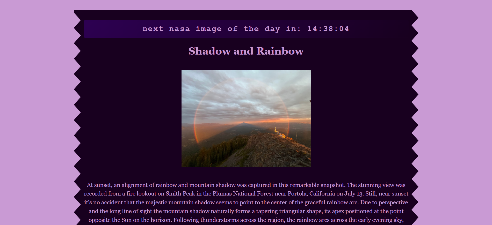

Hi, the website displays NASA's astronomical picture of the day, its title and description. It also shows countdown to next picture of the day.
Its written in Vite, Vanilla JS,HTML and CSS.

To run it locally:
It reqiures node to be installed as a prerequisite

1.First clone the repo:
git clone https://github.com/Harmancpu/nasadatastolen
2.Then install dependencies:
npm install
3.Create a .env file in root level.
4. Add your NASA APOD API key(Get a free API key at: https://api.nasa.gov):
VITE_NASA_API_KEY=your_api_key_here
5.run it locally:
npm run dev

Goto the url shown in terminal

If you wanna build it for production, do:
npm run build

I am using GITHUB PAGES to deploy it.

